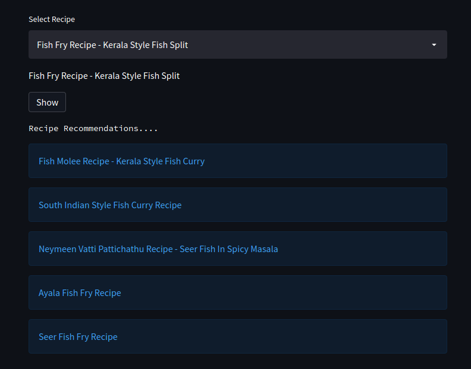

# Food_Recommendation_System
Food Recommendation System based on Ingredients and Cuisine

### Model recommends the food based on the Ingredients and Cuisine
### If we search for Maharashtrian cuisine or Punjabi cuisine then it will recommend food for that cuisine with similar ingredients available.

#### Result

#### With dish Image

 
### How to install Dependencies
#### `$ pip install -r requirements.txt`

### How to run website Locally
#### `$ streamlit run app.py`
